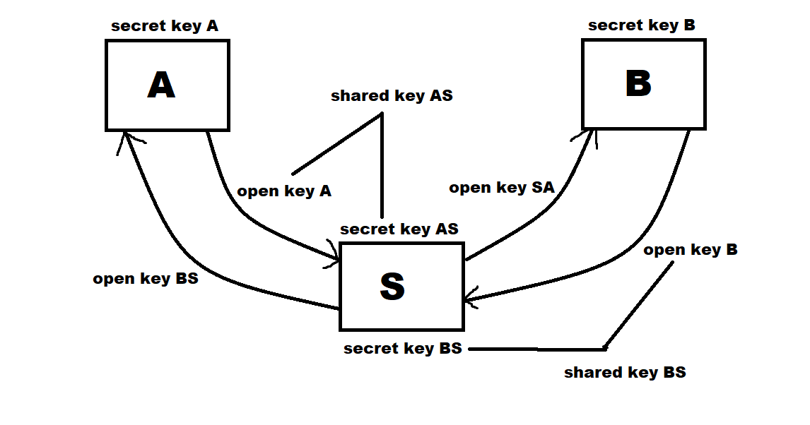

# Mitm-diffie-hellman
Simulated man in the middle attack on Diffie-Hellman protocol
## How does it work?
1. Alice generate and sends public key to proxy-server
2. Server receives Alice pubkey and generates own public key (open AS key on picture) and sends it to Bob
3. Bob receives key and send his open key to server
4. Server receives Bob pubkey and generates own public key (open BS key on picture) and sends it to Alice

So server got shared keys with Bob and Alice

Then server can read and modify all messages that pass through it

